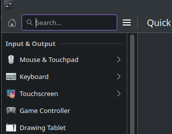
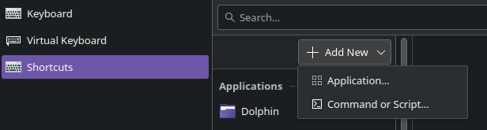

# Upload your screenshots via curl to [Vgy](https://vgy.me)

## Requirements

1. [Flameshot](https://flameshot.org), `curl`, and `jq` installed
2. [Vgy](https://vgy.me) API Key

## Installation

1. Download the script.
2. Make it executable.
3. Edit the script and change the variables to your needs.

## Setup a hotkey to run the script

1. Open the settings app and go to the keyboard section. 

2. Click on the "View and Customize Shortcuts" button.

3. Press it and scroll down to the "Custom Shortcuts" button and press it.

4. Press the "+" button. 

5. Give it a name and put the path to the script. Then click the "Set Shortcut" button and press the key you want to use.

6. Press the "Add" button and now you're done.
